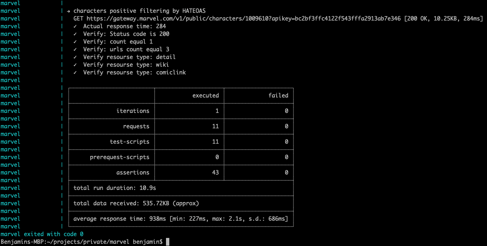
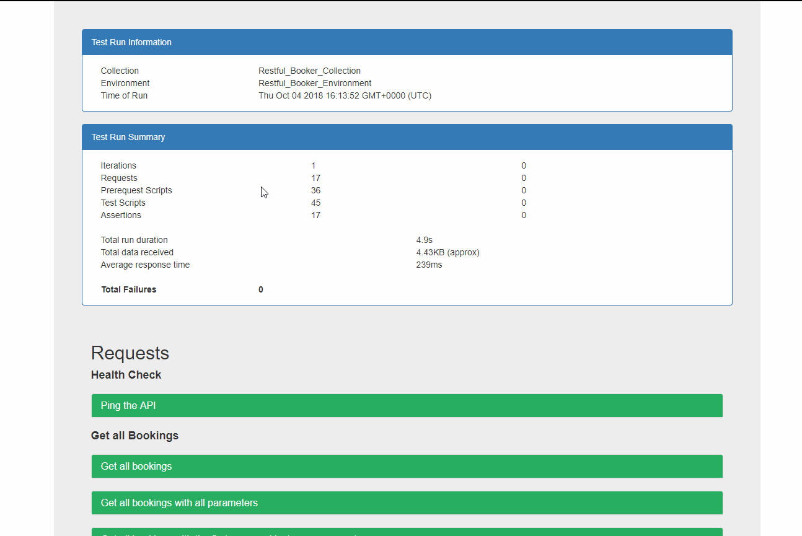

# MARVEL

[](https://app.getpostman.com/run-collection/696326b67e699ebe294e#?env%5Bmarvel%5D=W3sia2V5IjoiZW52IiwidmFsdWUiOiJodHRwczovL2dhdGV3YXkubWFydmVsLmNvbS8iLCJlbmFibGVkIjp0cnVlfSx7ImtleSI6InB1YmxpY0tleSIsInZhbHVlIjoiYmMyYmYzZmZjNDEyMmY1NDNmZmZhMjkxM2FiN2UzNDYiLCJlbmFibGVkIjp0cnVlfSx7ImtleSI6InByaXZhdGVLZXkiLCJ2YWx1ZSI6ImUzYmZjMDdlMjJkOGM3NzQxM2RhZDE0OTlhNzkxZjYzYjlkZDhkZTUiLCJlbmFibGVkIjp0cnVlfSx7ImtleSI6Im1vdmllTmFtZSIsInZhbHVlIjoiU3BpZGVyLU1hbiIsImVuYWJsZWQiOnRydWV9LHsia2V5IjoibW92aWVJZCIsInZhbHVlIjoiIiwiZW5hYmxlZCI6dHJ1ZX0seyJrZXkiOiJwYWdlTGltaXQiLCJ2YWx1ZSI6IjEwIiwiZW5hYmxlZCI6dHJ1ZX0seyJrZXkiOiJmaXJzdElkIiwidmFsdWUiOiIiLCJlbmFibGVkIjp0cnVlfSx7ImtleSI6ImNvbWljc0lkIiwidmFsdWUiOiIiLCJlbmFibGVkIjp0cnVlfV0=)
[](https://travis-ci.com/github/Benyamin-Rafaeli/marvel/)

### Implemented the following:
1. Positive Cases
2. Negative Cases
3. Executing with cli 
4. Executing wit Docker-Composer
5. Reporting in html format
6. You can also import collection to your local machine by clicking button [Run in Postman] from repo 
7. CI pipeline on Travis


### Running The Collection

To Build:
```
docker-compose build
```

To Run:
```
docker-compose up
```

To Remove:
```
docker-compose rm -f
```

To Run locally with newman:
```
newman run collection.json -e environment.json
```
### Run Postman Collections Using Docker


### Collection Run HTML Reports



